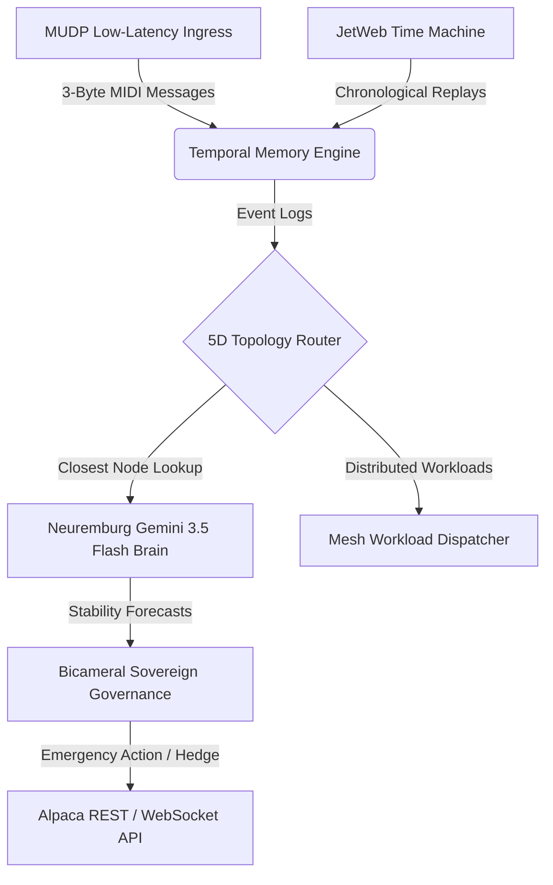

# Full-Stack Architectural Blueprint: PQR.INFO & JetWeb Time Machine

This document details the full-stack system topology, repository mapping, and cross-component integration for the `pqr.info` low-latency execution and backtesting services.

---

## 🏗️ Repository Architecture & Ecosystem

The `pqr.info` platform is powered by three main federated repository components hosted under the **Pqr-info** GitHub Organization:

### 1. Low-Latency MEV Protocol Engine (`pqr.info/mev`)
* **Repo**: [Pqr-info/mev](https://github.com/Pqr-info/mev)
* **Core Functions**:
  * **Transport Layer**: Custom Multiplexed UDP (MUDP) socket listeners and hyper-compact 3-byte MIDI transaction event serializers.
  * **Topology Router**: 5D SpaceTime coordinates network (`mesh_predictive_router_5d.go`) mapping and routing queries to the closest model provider nodes.
  * **Predictive Brain**: Built-in integrations routing cognitive queries through a local **Gemini 3.5 Flash** server host proxy on the Neuremburg node.
  * **Workload Dispatcher**: Concurrently divides simulation tasks and backtests across active mesh nodes.

### 2. JetWeb Time Machine Engine (`pqr.info/jetweb-time-machine`)
* **Repo**: [Pqr-info/jetweb-time-machine](https://github.com/Pqr-info/jetweb-time-machine)
* **Core Functions**:
  * **Chrono-Replay**: Constructs chronological event replay segments and drives historical data back through the router fabric.
  * **Timeslips**: Generates simulated time-displacement scenarios to validate system resilience under volatile market drifts.

### 3. Sovereign Node Core (`pqr.info/Sovereign_Node_Go_201mh`)
* **Repo**: [Pqr-info/Sovereign_Node_Go_201mh](https://github.com/Pqr-info/Sovereign_Node_Go_201mh)
* **Core Functions**:
  * **Jovian Archives**: Cold-storage data indexes and transaction ledger structures.
  * **Auth & Inbound Controller**: Node-level validation gates, RPC endpoints, and cross-node authorization layers.

---

## 🔗 Integrated Data & Workflow Loop

---

## ⚡ Deployment & Orchestration
1. **Local Sandbox Development**: Automated through the WSL `SOS` Linux distro.
2. **Production Deployment**: Executed via SSH deployment scripts targeting the remote Neuremburg server node (`46.224.219.174`).
3. **Observability Stack**: Monitored using Prometheus and Grafana dashboards for sub-microsecond transport latency metrics.
